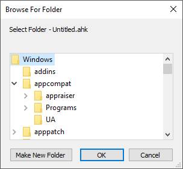

# ReplaceBrowseForFolder
Modern replacement for Browse For Folder dialogs

**Problem:** Whenever I come across those "Browse For Folder" dialogs it was always a pain in the assholes, because there is no place to paste the folder path or select from the Quick access bar, etc. Each folder has to be expanded level by level. It is also a hazard for automation as there is no Edit1 to set. Sadly this dialog is still being used to this day by many software, [even in AutoHotkey](https://www.autohotkey.com/docs/v1/lib/FileSelectFolder.htm). So I decided to take care of it once and for all.\
\
**Solution:** The following script will watch for "Browse For Folder" dialogs. When found, a modern folder select dialog would appear on top of it. Once confirmed, it would navigate to the provided path using _RemoteTreeView_ which controls the folder list through memory.\
The _SetPathForBrowseForFolder_ function can also be used separately for automation.\
\
**Libraries used (for convenience, they are included in the script):**\
[RemoteTreeViewClass](https://www.autohotkey.com/boards/viewtopic.php?t=4998#p29502)\
[SelectFolderEx](https://www.autohotkey.com/boards/viewtopic.php?t=18939)

To use, either download and run ReplaceBrowseForFolder.ahk (requires AutoHotkey v1.1); or download the compiled binary from [Releases](https://github.com/skygate2012/ReplaceBrowseForFolder/releases/tag/v1.1).

Forum post: [https://www.autohotkey.com/boards/viewtopic.php?f=6&t=124771](https://www.autohotkey.com/boards/viewtopic.php?f=6&t=124771)
